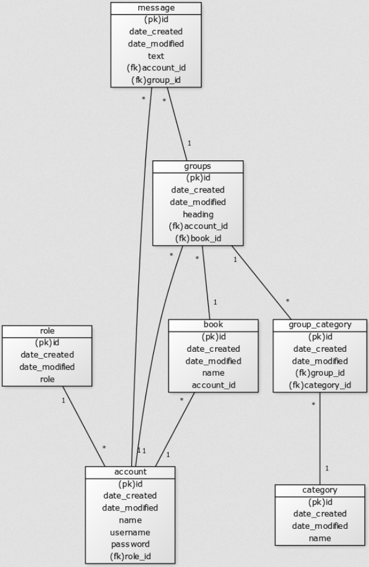

# Tietokantarakenne
## Tietokantataulu

Tietokanta ei ole täysin normalisoitu, koska käyttäjällä lähes kaikki on uniikkia ja käytin samaa pohjaa kaikille jossa pääavaimena on id, myös kirjan nimi on uniikki ja sillä on id samasta pohjasta.

## Tietokannan pöytien luonti
	CREATE TABLE category (
		id INTEGER NOT NULL, 
	   	date_created DATETIME, 
	   	date_modified DATETIME, 
	   	name VARCHAR(15) NOT NULL, 
	   	PRIMARY KEY (id), 
	   	UNIQUE (name)
	);

	CREATE TABLE role (
	   	id INTEGER NOT NULL, 
	   	date_created DATETIME, 
	   	date_modified DATETIME, 
	   	role VARCHAR(80) NOT NULL, 
	   	PRIMARY KEY (id), 
	   	UNIQUE (role)
	);
	
	CREATE TABLE account (
	   	id INTEGER NOT NULL, 
	   	date_created DATETIME, 
		date_modified DATETIME, 
		name VARCHAR(144) NOT NULL, 
		username VARCHAR(144) NOT NULL, 
		password VARCHAR(144) NOT NULL, 
		role_id INTEGER NOT NULL, 
		PRIMARY KEY (id), 
		UNIQUE (name), 
		UNIQUE (username), 
		FOREIGN KEY(role_id) REFERENCES role (id)
	);
	
	CREATE TABLE book (
		id INTEGER NOT NULL, 
		date_created DATETIME, 
		date_modified DATETIME, 
		name VARCHAR(40) NOT NULL, 
		account_id INTEGER NOT NULL, 
		PRIMARY KEY (id), 
		UNIQUE (name), 
		FOREIGN KEY(account_id) REFERENCES account (id)
	);
	
	CREATE TABLE groups (
		id INTEGER NOT NULL, 
		date_created DATETIME, 
		date_modified DATETIME, 
		heading VARCHAR(20) NOT NULL, 
		account_id INTEGER NOT NULL, 
		book_id INTEGER, 
		PRIMARY KEY (id), 
		FOREIGN KEY(account_id) REFERENCES account (id), 
		FOREIGN KEY(book_id) REFERENCES book (id)
	);
	
	CREATE TABLE group_category (
		id INTEGER NOT NULL, 
		date_created DATETIME, 
		date_modified DATETIME, 
		group_id INTEGER NOT NULL, 
		category_id INTEGER NOT NULL, 
		PRIMARY KEY (id), 
		FOREIGN KEY(group_id) REFERENCES groups (id), 
		FOREIGN KEY(category_id) REFERENCES category (id)
	);
	
	CREATE TABLE message (
		id INTEGER NOT NULL, 
		date_created DATETIME, 
		date_modified DATETIME, 
		text VARCHAR(10000) NOT NULL, 
		account_id INTEGER NOT NULL, 
		group_id INTEGER NOT NULL, 
		PRIMARY KEY (id), 
		FOREIGN KEY(account_id) REFERENCES account (id), 
		FOREIGN KEY(group_id) REFERENCES groups (id)
	);

